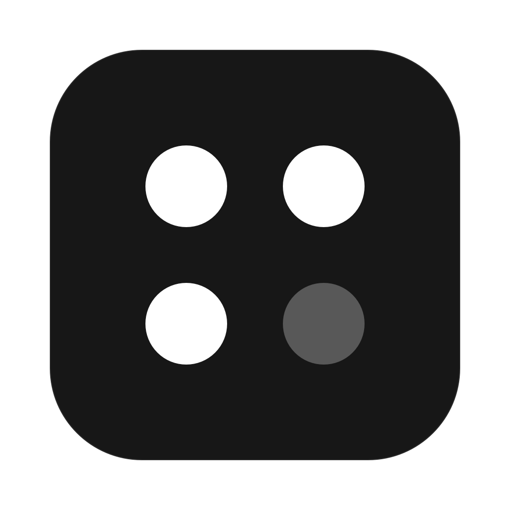

<p align="center"></p>

# portbar

A macOS menu bar app that shows which dev servers run on your Mac, per repository and worktree.

portbar reads the process table directly through libproc. It does not start `lsof` or `git`. Every 2 seconds it:

1. Finds your processes and their listening TCP ports.
2. Folds each process tree into one service. For example, `bun run dev` → `concurrently` → `next dev` plus workers becomes one "Next.js :3000" row.
3. Finds the repository, worktree, and branch from the process working directory. All worktrees of one repository show under one project.
4. Marks services that need attention:
   - **Detached**: the terminal or tool that started the service is gone.
   - **Not responding**: the port is open, but the server does not answer HTTP. portbar checks this only when the panel opens, at most once a minute per port.
   - **High CPU**: CPU use stays above 80% for three scans in a row.

## Projects, scripts, and settings

- **Pinned projects** stay at the top of the panel, also when they are stopped. Pin a project from its right-click menu or in Settings > Projects. Drag to change the order.
- **Scripts:** the play button next to a project lists its `package.json` scripts and your own commands. Starred scripts show as buttons next to pinned projects. portbar runs each script in your login shell, keeps its logs, and stops the whole process tree when you stop it.
- **Project icons:** portbar looks for `apple-touch-icon.png`, `icon.png`, `favicon.*`, and the Expo `app.json` icon. You can pick another file, use the framework mark, or turn icons off.
- **Menu bar:** the default is a 2×2 dot grid. Each pinned project has a dot: filled when it runs, a ring when it is stopped, and orange when it needs attention. Free dots show other running projects. Settings > General also has "Icon" and "Icon and count".
- **Panel:** Settings > Panel sets the density and turns the command line, CPU sparkline, memory, and uptime on or off.
- **Hidden:** hide processes by text in their command line, and show hidden projects again.

## Install

With Homebrew:

```sh
brew install 1fc0nfig/tap/portbar
```

Or download the DMG from [Releases](https://github.com/1fc0nfig/portbar/releases) and drag portbar to Applications.

portbar needs macOS 14 or later. The app has an ad-hoc signature, not a Developer ID. The Homebrew cask removes the quarantine flag for you. If you install from the DMG, right-click the app and select Open the first time.

portbar updates itself with [Sparkle](https://sparkle-project.org). It checks for a new release once a day, downloads it, and installs it when portbar quits. Click the arrow in the panel header to restart and update at once. You can turn this off in Settings › General › Updates.

## Development

You need Xcode 16 or the Swift 6 toolchain.

```sh
make hooks     # once per clone: use the hooks in .githooks
make test      # unit tests
make install   # build, copy to /Applications, and start
make dmg       # universal build, then dist/portbar-<version>.dmg and .zip
make icons     # regenerate the brand marks and the app icon
```

The hooks do two checks:

- **pre-commit** builds the package and runs the unit tests when Swift files change. A build warning stops the commit.
- **commit-msg** accepts only [Conventional Commits](https://www.conventionalcommits.org), for example `feat: show exit codes` or `fix(ui): clip the details`. release-please reads these messages to pick the next version.

CI runs the same build and tests on each pull request and on each push to `main`.

## Releasing

1. Merge pull requests into `main` with Conventional Commit messages.
2. release-please opens a release pull request. It bumps `version.txt` and updates `CHANGELOG.md`.
3. Merge the release pull request. release-please tags the version and creates the GitHub release.
4. The Release workflow builds a universal app and attaches the DMG and the zip to the release.
5. The workflow signs the zip and attaches `appcast.xml`, the feed that Sparkle reads.
6. The workflow writes `Casks/portbar.rb` in [1fc0nfig/homebrew-tap](https://github.com/1fc0nfig/homebrew-tap).

The workflow needs two secrets:

- `SPARKLE_PRIVATE_KEY`: the EdDSA key that signs updates. The login Keychain keeps a copy under the account `portbar`. Export it with `generate_keys --account portbar -x <file>`. The public key is `SUPublicEDKey` in `Resources/Info.plist`.
- `TAP_DEPLOY_KEY`: an SSH deploy key with write access to the tap repository.

If a secret is missing, the workflow stops with an error.

## Debug

```sh
swift run portbar --dump             # print the detected services
swift run portbar --render out.png   # save the panel and menu bar mark as images
swift run portbar --run-test <dir> dev   # start a script, check logs and matching, then stop it
```

## Icons

The app icon comes from `scripts/gen-app-icon.swift`. It draws the menu bar dot grid on a dark tile.

Brand marks come from [Simple Icons](https://simpleicons.org) (CC0). The app draws them as vector paths. To add a framework, add its slug to `scripts/gen-icons.py`, run the script, and add a rule in `Sources/Portbar/Model/Classifier.swift`.

## Layout

| Path | Purpose |
|---|---|
| `System/ProcessScanner.swift` | libproc and sysctl: processes, argv, cwd, CPU, memory, listening ports |
| `System/GitResolver.swift` | Directory to repository, worktree, and branch, from `.git` files |
| `System/HealthProbe.swift` | HTTP check for "Not responding" |
| `Model/Classifier.swift` | Command line to framework, and service, wrapper, or worker role |
| `Model/Services.swift` | Process trees to services, projects, and issues |
| `System/ScriptRunner.swift` | Runs scripts in the login shell environment and keeps their logs |
| `Model/Settings.swift` | Preferences, saved as JSON in UserDefaults |
| `Model/ProjectCatalog.swift` | Project scripts and icons |
| `UI/` | SwiftUI panel, Settings window, log window, menu bar mark |

## License

MIT
